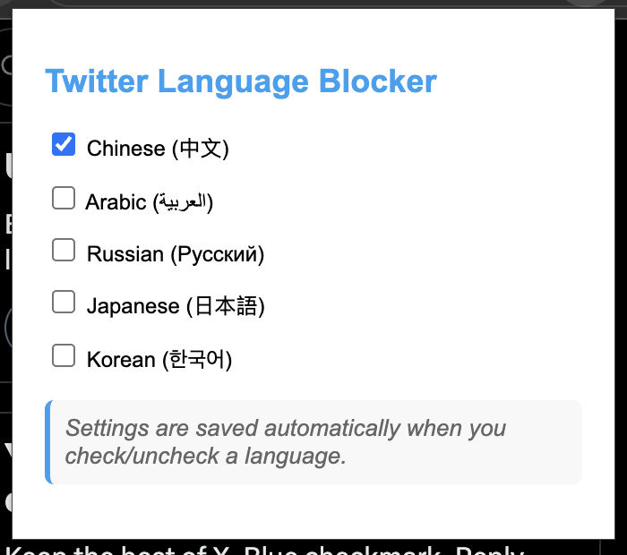

# Twitter Language Blocker

A simple Chrome extension that blocks tweets in specific languages (like Chinese, Arabic, Russian, etc.) from appearing in your Twitter/X timeline.



## Features

- **Block Multiple Languages**: Filter out tweets in Chinese, Arabic, Russian, Japanese, Korean
- **Simple Interface**: Easy-to-use checkbox selection for languages to block
- **Automatic Settings**: Settings save automatically when you toggle language options
- **Real-time Filtering**: Blocks tweets as you scroll without needing to refresh
- **Lightweight**: Minimal impact on browser performance
- **Site-Specific**: Only works on Twitter/X websites - doesn't affect any other sites

## Installation

Since this extension is distributed via GitHub (not the Chrome Web Store), follow these steps to install it:

### Method 1: Direct Download and Install

1. **Download the ZIP file**:
   - Click the green "Code" button at the top of this repository
   - Select "Download ZIP"
   - Extract the ZIP file to a folder on your computer

2. **Install in Chrome**:
   - Open Chrome and navigate to `chrome://extensions/`
   - Enable "Developer mode" in the top-right corner
   - Click "Load unpacked"
   - Select the folder containing the extracted extension files

### Method 2: Clone the Repository

```bash
# Clone the repository
git clone https://github.com/yourusername/twitter-lingo-blocker.git

# Then install in Chrome as described above
```

## How to Use

1. After installation, you'll see the extension icon in your Chrome toolbar
2. Click the icon to open the extension popup
3. Check the boxes next to languages you want to block
4. Settings are saved automatically - no need to click a save button
5. Browse Twitter/X - tweets in the selected languages will be hidden automatically
6. Your settings will persist between browser sessions and page refreshes

## How It Works

The extension scans tweets on your timeline using Unicode character ranges to detect different languages. When a tweet contains text in one of your blocked languages, the extension hides that tweet.

## Technical Details

- Uses MutationObserver to detect and process new tweets as they load
- Language detection via Unicode character ranges
- Settings stored in Chrome's sync storage for persistence across devices
- Automatically applies settings when Twitter/X pages load or refresh
- Compatible with both twitter.com and x.com domains
- Only runs on Twitter/X domains - other websites remain unaffected

## Privacy

This extension:
- Does NOT collect any personal data
- Does NOT send any information to external servers
- All processing happens locally in your browser
- Your language preferences are stored only in your browser's local storage
- Only activates on Twitter/X websites

## Contributing

Contributions are welcome! Feel free to:
- Report bugs
- Suggest new features
- Add support for additional languages
- Improve the user interface

## License

MIT License

## Acknowledgements

- Thanks to everyone who contributed to this project!
- Icon created with SVG 